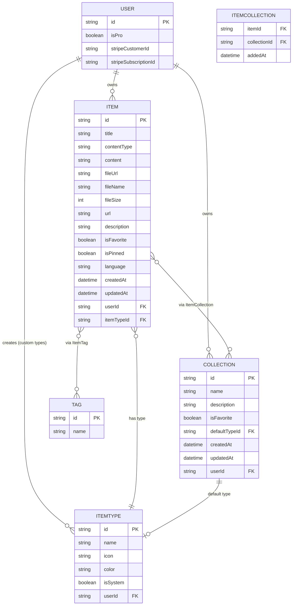
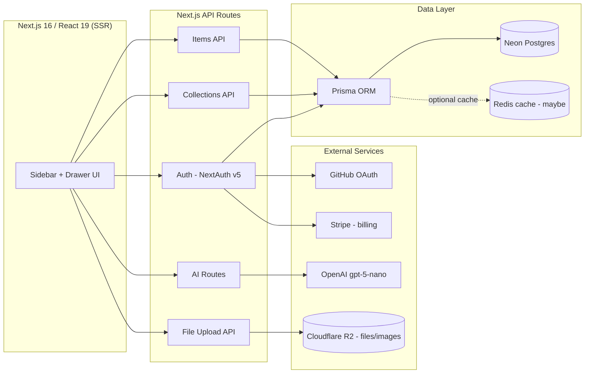

# DevStash — Project Overview

> A single, fast, searchable, AI-enhanced hub for all developer knowledge and resources.

---

## 1. Problem

Developers scatter their day-to-day resources across too many tools:

| Resource          | Typical (wrong) home             |
| ----------------- | -------------------------------- |
| Code snippets     | VS Code / Notion                 |
| AI prompts        | Chat history                     |
| Context files     | Buried in random project folders |
| Useful links      | Browser bookmarks                |
| Docs              | Random folders                   |
| Commands          | `.txt` files                     |
| Project templates | GitHub Gists                     |
| Terminal commands | Shell history                    |

The result is constant context-switching, lost knowledge, and inconsistent workflows. **DevStash** solves this by giving developers one place to save, organize, search, and (optionally) AI-enhance everything they need.

---

## 2. Target Users

- **Everyday Developer** — wants a fast way to grab snippets, prompts, commands, and links.
- **AI-first Developer** — saves prompts, contexts, workflows, and system messages.
- **Content Creator / Educator** — stores code blocks, explanations, course notes.
- **Full-Stack Builder** — collects patterns, boilerplates, API examples.

---

## 3. Core Features

### A. Items & Item Types

Items are the atomic unit of DevStash. Every item has a **type**, which determines how it's stored and rendered.

**System types** (fixed, cannot be edited/deleted by users):

| Type         | Content kind |
| ------------ | ------------ |
| Snippet      | text         |
| Prompt       | text         |
| Note         | text         |
| Command      | text         |
| Link         | url          |
| File 🔒 Pro  | file         |
| Image 🔒 Pro | file         |

- Users can later create **custom types** (Pro, post-MVP).
- Items are designed to be created/viewed quickly inside a **drawer** (no full-page navigation required).
- Route convention: `/items/[type]` (e.g. `/items/snippets`).

### B. Collections

- A collection groups items of _any_ type (e.g. "React Patterns" can hold snippets **and** notes).
- **Many-to-many**: an item can belong to multiple collections (a React snippet could live in both "React Patterns" and "Interview Prep").
- Examples: _React Patterns_, _Context Files_, _Python Snippets_.

### C. Search

Full-text search across:

- Content
- Tags
- Titles
- Types

### D. Authentication

- Email/password
- GitHub OAuth
- (via NextAuth v5)

### E. Quality-of-life Features

- Favorite collections & items
- Pin items to top
- "Recently used" list
- Import code from a file
- Markdown editor for text-based types
- File upload for `file` / `image` types
- Export data (multiple formats)
- Dark mode (default)
- Add/remove an item to/from multiple collections
- View which collections a given item belongs to

### F. AI Features 🔒 Pro only

- AI auto-tag suggestions
- AI summaries
- "Explain this code"
- Prompt optimizer

---

## 4. Data Model

### 4.1 Entity Relationship Diagram



### 4.2 Prisma Schema (draft)

```prisma
// schema.prisma
// Postgres (Neon) + Prisma 7

generator client {
  provider = "prisma-client-js"
}

datasource db {
  provider = "postgresql"
  url      = env("DATABASE_URL")
}

// ---------- Auth (NextAuth v5) ----------

model User {
  id                   String    @id @default(cuid())
  name                 String?
  email                String?   @unique
  emailVerified        DateTime?
  image                String?

  isPro                Boolean   @default(false)
  stripeCustomerId     String?   @unique
  stripeSubscriptionId String?   @unique

  accounts    Account[]
  sessions    Session[]
  items       Item[]
  collections Collection[]
  itemTypes   ItemType[]

  createdAt DateTime @default(now())
  updatedAt DateTime @updatedAt
}

model Account {
  id                String  @id @default(cuid())
  userId            String
  type              String
  provider          String
  providerAccountId String
  refresh_token     String?
  access_token      String?
  expires_at        Int?
  token_type        String?
  scope             String?
  id_token          String?
  session_state     String?

  user User @relation(fields: [userId], references: [id], onDelete: Cascade)

  @@unique([provider, providerAccountId])
}

model Session {
  id           String   @id @default(cuid())
  sessionToken String   @unique
  userId       String
  expires      DateTime

  user User @relation(fields: [userId], references: [id], onDelete: Cascade)
}

// ---------- Core domain ----------

enum ContentType {
  TEXT
  FILE
  URL
}

model ItemType {
  id       String  @id @default(cuid())
  name     String
  icon     String
  color    String
  isSystem Boolean @default(false)

  userId String?
  user   User?   @relation(fields: [userId], references: [id], onDelete: Cascade)

  items              Item[]
  defaultForCollection Collection[]

  @@unique([userId, name])
}

model Item {
  id          String      @id @default(cuid())
  title       String
  contentType ContentType

  content     String?     // text content (snippet/prompt/note/command)
  fileUrl     String?     // R2 URL (file/image)
  fileName    String?
  fileSize    Int?
  url         String?     // link type

  description String?
  language    String?     // optional, for code snippets
  isFavorite  Boolean     @default(false)
  isPinned    Boolean     @default(false)

  userId     String
  user       User        @relation(fields: [userId], references: [id], onDelete: Cascade)

  itemTypeId String
  itemType   ItemType    @relation(fields: [itemTypeId], references: [id])

  collections ItemCollection[]
  tags        ItemTag[]

  createdAt DateTime @default(now())
  updatedAt DateTime @updatedAt

  @@index([userId])
  @@index([itemTypeId])
}

model Collection {
  id          String   @id @default(cuid())
  name        String
  description String?
  isFavorite  Boolean  @default(false)

  defaultTypeId String?
  defaultType   ItemType? @relation(fields: [defaultTypeId], references: [id])

  userId String
  user   User   @relation(fields: [userId], references: [id], onDelete: Cascade)

  items ItemCollection[]

  createdAt DateTime @default(now())
  updatedAt DateTime @updatedAt

  @@index([userId])
}

model ItemCollection {
  itemId       String
  collectionId String
  addedAt      DateTime @default(now())

  item       Item       @relation(fields: [itemId], references: [id], onDelete: Cascade)
  collection Collection @relation(fields: [collectionId], references: [id], onDelete: Cascade)

  @@id([itemId, collectionId])
}

model Tag {
  id   String @id @default(cuid())
  name String @unique

  items ItemTag[]
}

model ItemTag {
  itemId String
  tagId  String

  item Item @relation(fields: [itemId], references: [id], onDelete: Cascade)
  tag  Tag  @relation(fields: [tagId], references: [id], onDelete: Cascade)

  @@id([itemId, tagId])
}
```

> ⚠️ **Migration policy**: Never use `prisma db push` or edit the database schema directly. All schema changes go through Prisma **migrations**, run first in dev, then promoted to prod.

---

## 5. Architecture



---

## 6. Tech Stack

| Layer        | Choice                                                   |
| ------------ | -------------------------------------------------------- |
| Framework    | Next.js 16 / React 19, SSR pages with dynamic components |
| Backend      | Next.js API routes (items, file uploads, AI calls)       |
| Language     | TypeScript                                               |
| Database     | Neon (PostgreSQL)                                        |
| ORM          | Prisma 7 (latest — check current docs)                   |
| Cache        | Redis (maybe, TBD)                                       |
| File storage | Cloudflare R2                                            |
| Auth         | NextAuth v5 (email/password + GitHub OAuth)              |
| AI           | OpenAI `gpt-5-nano`                                      |
| Styling      | Tailwind CSS v4 + shadcn/ui                              |

**Repo structure:** single codebase / single repo (frontend + API together) to minimize overhead.

**Hard rule:** never `db push` or hand-edit the database — schema changes always go through migrations (dev → prod).

---

## 7. Monetization — Freemium

|                      | **Free**              | **Pro** — $8/mo or $72/yr |
| -------------------- | --------------------- | ------------------------- |
| Items                | 50 total              | Unlimited                 |
| Collections          | 3                     | Unlimited                 |
| System types         | All except File/Image | All                       |
| File & image uploads | ❌                    | ✅                        |
| Custom types         | ❌                    | ✅ (later)                |
| Search               | Basic                 | Basic                     |
| AI auto-tagging      | ❌                    | ✅                        |
| AI code explanation  | ❌                    | ✅                        |
| AI prompt optimizer  | ❌                    | ✅                        |
| Export (JSON/ZIP)    | ❌                    | ✅                        |
| Support              | Standard              | Priority                  |

**Dev note:** build the Pro-gating foundation now (`isPro`, Stripe fields, feature flags), but during active development **all users get full access** to every feature regardless of plan.

---

## 8. UI / UX

### General

- Modern, minimal, developer-focused — think **Notion**, **Linear**, **Raycast**.
- Dark mode by default; light mode optional.
- Clean typography, generous whitespace, subtle borders/shadows.
- Syntax highlighting on all code blocks.

### Layout

- **Sidebar** (collapsible): item types (Snippets, Commands, etc.) with direct links, plus latest collections.
- **Main area**: grid of collection cards, color-coded by the item type that dominates that collection (background color). Items render inside their collection card with a border color matching their own type.
- **Item detail**: opens in a quick-access **drawer**, not a full page.

### Responsive

- Desktop-first, mobile-usable.
- Sidebar collapses into a drawer on mobile.

### Micro-interactions

- Smooth transitions
- Hover states on cards
- Toast notifications for actions
- Loading skeletons

### Screenshots

Refer to the screenshots below as a base for the dashboard UI. It does not have to be exact. Use it as a reference:

- @context/screenshots/dashboard-ui-main.png
- @context/screenshots/dashboard-ui-drawer.png

### Type Colors & Icons (Lucide icon names)

| Type    | Color      | Hex       | Icon         |
| ------- | ---------- | --------- | ------------ |
| Snippet | 🔵 Blue    | `#3b82f6` | `Code`       |
| Prompt  | 🟣 Purple  | `#8b5cf6` | `Sparkles`   |
| Command | 🟠 Orange  | `#f97316` | `Terminal`   |
| Note    | 🟡 Yellow  | `#fde047` | `StickyNote` |
| File    | ⚪ Gray    | `#6b7280` | `File`       |
| Image   | 🌸 Pink    | `#ec4899` | `Image`      |
| Link    | 🟢 Emerald | `#10b981` | `Link`       |

---

## 9. Open Questions / Things to Decide Later

- Redis caching — needed at launch or add later once traffic justifies it?
- Custom item types — full spec for how users define color/icon/content-kind.
- Export formats — confirm exact set (JSON, ZIP, Markdown bundle?).
- Rate limiting / quota enforcement strategy for the 50-item / 3-collection free tier.
- Whether `ItemType.userId = null` (system types) needs a dedicated seed migration.

---

### Reference Links

- Next.js docs: https://nextjs.org/docs
- Prisma docs: https://www.prisma.io/docs
- NextAuth v5 docs: https://authjs.dev
- Cloudflare R2 docs: https://developers.cloudflare.com/r2/
- Neon docs: https://neon.tech/docs
- shadcn/ui: https://ui.shadcn.com
- Tailwind CSS v4: https://tailwindcss.com/docs
